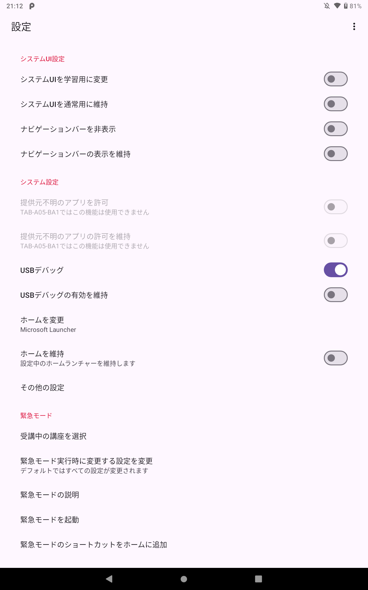
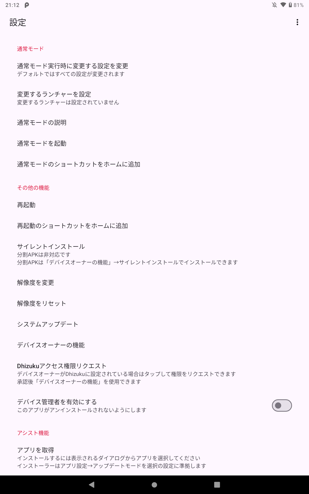
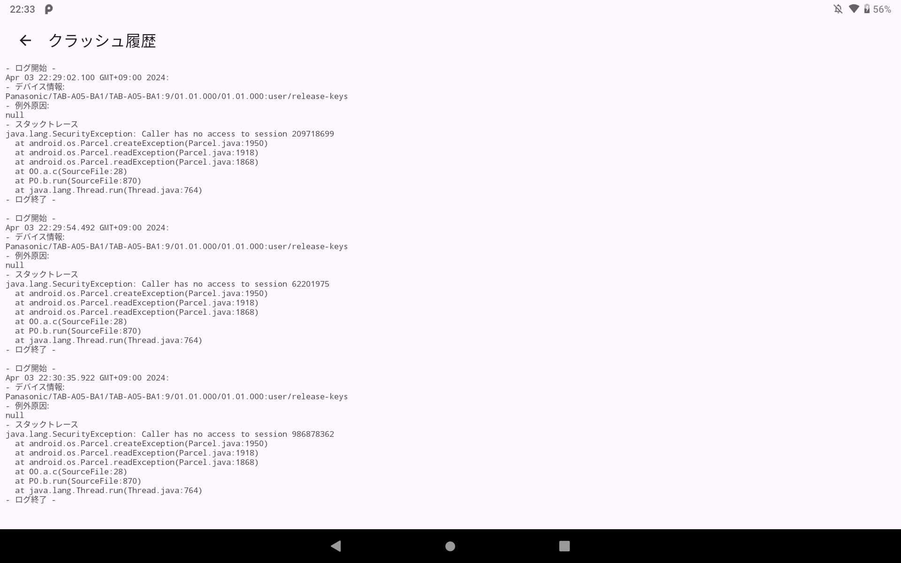

# CPad Customize Tool

このアプリケーションはチャレンジパッドの設定を変更することができます。

学習兼用環境での改造サポートを提供します。

## 初期状態からのインストール
[SetupLogin](https://github.com/Kobold831/SetupLogin/blob/master/docs/README.md)から簡単に利用できるようになりました。

+ [SetupLogin](https://github.com/Kobold831/SetupLogin/blob/master/docs/README.md)にあるとおりにセットアップをしてください。
+ チャレンジパッド総合カスタマイズツールを選択して続行します。
+ このアプリが起動します。

## 機能

- システムUI・ナビゲーションバーの設定変更
- システム設定の変更
- 解像度の変更
- 内臓ブラウザ
  - WebViewを使用したブラウザを起動します。  
    セキュリティのためHTTP接続、ファイルアクセス機能は使用できません。
- 学習両立モード
  - 緊急モード  
    デバイスを瞬時に学習環境に変更します。
  - 通常モード  
    デバイスを瞬時に通常環境に変更します。
- サイレントインストール
  - 対応した拡張子(.apk・.xapk・.apkm)のみ対応しています。  
    DchaServiceまたはデバイスオーナーでインストールします。
- アンインストールブロッカー
  - インストールされているアプリケーションがDchaServiceにアンインストールされないようにします。  
    学習環境と両立している場合は設定をおすすめします。

## 対応機種

- チャレンジパッド２シリーズ
- チャレンジパッド３
- チャレンジパッドNeo
- チャレンジパッドNext

## 動作要件

このアプリの動作には以下が必要です。

- DchaService
  - DchaServiceを使用しない場合でもこのアプリを使用できますが、一部の機能は制限されます。

## サンプル画像

<a href="#"></a> <a href="#"></a>

## 権限付与

一部の機能を使用するには `WRITE_SECURE_SETTINGS` の権限が必要です。

付与されない場合でも他の機能は問題なく機能します。

アプリにセキュア設定の変更を許可する場合は以下のコマンドをADBで実行してください。

```
adb shell pm grant com.saradabar.cpadcustomizetool android.permission.WRITE_SECURE_SETTINGS
```

## デバイスオーナー

アンインストールブロッカーなどの一部の機能を使用するにはデバイスオーナーを設定する必要があります。

デバイスオーナーは[Dhizuku](https://github.com/iamr0s/Dhizuku)に設定することを推奨します。

> [!WARNING]
> デバイスオーナーの設定をするときはデバイスにアカウントが１つも存在しないか確認してください。  
> Google アカウント等が追加されていると設定できません。

Dhizukuに設定する場合は以下のコマンドをADBで実行してください。

```
adb shell dpm set-device-owner com.rosan.dhizuku/.server.DhizukuDAReceiver
```

> [!NOTE]
> 通常、CPadCustomizeTool にデバイスオーナーを設定する必要はありません。

このアプリに設定する場合は以下のコマンドをADBで実行してください。

```
adb shell dpm set-device-owner com.saradabar.cpadcustomizetool/.Receiver.AdministratorReceiver
```

## 既知の問題

### Dhizukuで任意のapkをサイレントインストールしようとするとSecurityExceptionがスローされる

- 修正状況
  - このアプリに起因する問題でないため修正はありません。

- 症状
  - 以下のクラッシュ（ **Caller has no access to session** ）が発生する。
    [](#)
- 原因と対処法
  - Dhizukuに権限が付与されていない可能性があります。
  - Dhizukuに権限（ストレージなど）が付与されているかを確認してください。
  - アプリデータ（Androidフォルダ）内のファイルは権限の関係上取得できないのでエラーが発生する可能性があります。
  - 何度もエラーになる場合は、内部ストレージまたはsdカード直下に配置して試してください。

### アプリケーションのクラッシュ

- 修正状況
  - Dhizukuの機能で発生していたクラッシュは修正しました。
  - 想定外な操作へ安定した動作をするように改善しています。

- 確認した症状
  - ダイアログの表示または非表示時にクラッシュする。

- 原因と対処法
  - ダイアログの表示中はダイアログが消えるまで以下の操作をしないでください。サイレントインストール時も同様です。バックグラウンド動作は保証していません。
    - アプリケーションの切り替え。
    - 画面やデバイスの回転。
    - デバイスの操作。
    - 押下時の不必要な連打。
    - 素早い画面の切り替え。

### アプリケーションのインストールに失敗する。

- 修正状況
  - 想定外な操作へ安定した動作をするように改善しています。

- 確認した症状
  - サイレントインストールをしようとすると失敗する。

- 原因と対処法
  - 以下を確認してください。改善しない場合は不具合の可能性があります。
    - Android標準の純正ファイルマネージャーでインストールファイルを選択してください。
    - サイレントインストール押下時にファイルマネージャーの選択画面が表示された場合は、ファイル（元からインストールされています。）を選択してください。
    - Android標準の純正ファイルマネージャーが表示されたら、右上の︙マークを押して、内部ストレージを表示が押されていることを確認してください。（左上の≡を押して内部ストレージまたはSDカードの欄が表示されていれば設定されています。）
    - 左上の≡を押して内部ストレージまたはSDカードの欄が表示されていることを確認してください。
    - インストールしたいアプリファイルを選択するときに、左上の≡の内部ストレージまたはSDカードの欄を押してからファイルを選択していることを確認してください。
    - アプリデータ（Androidフォルダ）内のファイルは権限の関係上取得できないのでエラーが発生する可能性があります。
    - 何度もエラーになる場合は、内部ストレージまたはsdカード直下に配置して試してください。

## 問題の報告

新たなバグや修正方法を見つけた場合は、お手数ですが [報告](https://github.com/Kobold831/CPadCustomizeTool/issues/new/choose) をお願いします。

GitHubアカウントを持っていない場合、または匿名を希望の場合は[Google フォームから報告](https://forms.gle/LnGuEc4GdRmwzf3GA)できます。

## 外部ライブラリー

このアプリは以下のライブラリーを使用しています。

- [welcome-android](https://github.com/stephentuso/welcome-android)
  
  Copyright © 2015-2017 Stephen Tuso

- [ZeroTurnaround ZIP Library](https://github.com/zeroturnaround/zt-zip)
  
  Copyright © 2012 ZeroTurnaround LLC.

- [Dhizuku-API](https://github.com/iamr0s/Dhizuku-API)
  
  Copyright © 2023 R0S
