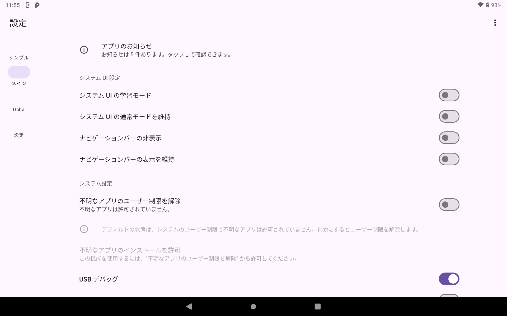

# CPad Customize Tool

このアプリケーションはチャレンジパッドの設定を変更することができます。

学習兼用環境での改造サポートを提供します。

## 初期状態からのインストール
SDカード から簡単に利用できるようになりました。

+ [**SetupLogin**](https://github.com/Kobold831/SetupLogin/blob/master/docs/README.md) を参考にセットアップしてください。
+ アプリ一覧が表示されたら、\[**チャレンジパッド総合カスタマイズツール**\] を選択して続行します。

## 機能

標準機能一覧です。  
その他、別機能を要求するものに関しては、**動作推奨要件** をご覧ください。

- **システムUI / ナビゲーションバー** の設定変更
- システム設定の変更
- 内臓ブラウザ
  - WebView を使用したブラウザを起動します。  
    セキュリティ保護のため、HTTP(非SSL)接続、ファイルアクセス機能は使用できません。
- 学習両立モード  
  デバイスを学習モードまたは通常モードに瞬時に切り替えます

## 対応機種

- チャレンジパッド２
  - TAB-A03-BS
  - TAB-A03-BR
  - TAB-A03-BR2
  - TAB-A03-BR2B
- チャレンジパッド３
  - TAB-A04-BR3
- チャレンジパッドNeo
  - TAB-A05-BD
- チャレンジパッドNext
  - TAB-A05-BA1

## 動作推奨要件

- **DchaService**
  - 単一APKのサイレントインストール
  - 既定のランチャーの切り替え
  - 再起動のショートカット
  - ファームウェアアップデート  
    ファイルは各自で用意する必要あり
- **DchaUtilService**
  - 解像度の変更
- 端末所有者 (デバイスオーナー)
  - アンインストールブロック
  - サイレントインストール
  - アプリの権限自動昇格

## サンプル画像

<a href="#"></a>  
<a href="#"></a>

## 権限付与

ADB 及び 開発者向けオプション の状態を保持する機能を使用するには、  
`WRITE_SECURE_SETTINGS` の権限が必要です。

アプリで該当の設定の有効にするには、  
以下のコマンドをADBで実行してください：

```
adb shell pm grant com.saradabar.cpadcustomizetool android.permission.WRITE_SECURE_SETTINGS
```

## デバイスオーナー

アンインストールブロッカーなどの一部の機能を使用するにはデバイスオーナーを設定する必要があります。

デバイスオーナーには [**Dhizuku**](https://github.com/iamr0s/Dhizuku) が推奨されています。

> [!WARNING]
> デバイスオーナーの設定をする際にデバイスにアカウントが１つも存在しないか確認してください。  
> Google アカウント等が追加されていると設定できません。

**Dhizuku** に設定する場合は以下のコマンドをADBで実行してください：

```
adb shell dpm set-device-owner com.rosan.dhizuku/.server.DhizukuDAReceiver
```

> [!NOTE]
> 通常、CPadCustomizeTool にデバイスオーナーを設定する必要はありません。

Dhizuku を何らかの理由で設定できない場合は、  
このアプリに設定する以下のコマンドをADBで実行してください：

```
adb shell dpm set-device-owner com.saradabar.cpadcustomizetool/.Receiver.AdministratorReceiver
```

> [!TIP]
> デバイスオーナーは複数設定することはできません

## 既知の問題

### Dhizuku が DO の状態で サイレントインストールしようとすると **SecurityException** が発生する

- 原因
  - Dhizuku のアプリに権限が付与されていない可能性があります。

- 修正状況
  - このアプリに起因する問題でないため修正できません。

- 症状
  - 以下のクラッシュ（ **Caller has no access to session** ）が発生する。
    [](#)
    
- 対処法
  - Dhizuku アプリに権限（ストレージなど）が付与されているかを確認してください。
  - アプリデータ（ `/sdcard/Android/` フォルダ）内のファイルは、権限の関係上取得できないのでエラーが発生する可能性があります。
  - 何度もエラーになる場合は、APK ファイルを 内部ストレージ または SDカード直下 に配置して試してください。

### アプリケーションのクラッシュ

- 修正状況
  - Dhizuku の機能で発生していたクラッシュは修正しました。
  - ネットワークが接続されていない状態でアプリを起動したときに発生していたクラッシュは修正しました。（v2.4.3）
  - 想定外な操作へ安定した動作をするように改善しています。

- 症状
  - ダイアログの表示または非表示時にクラッシュする。

- 対処法
  - ネットワークが接続されていない状態でアプリを起動したときに
    発生していたクラッシュは修正しました。（v2.4.3）
  - ダイアログの表示中はダイアログが消えるまで以下の操作をしないでください。  
    サイレントインストール時も同様です。  
    バックグラウンド動作は保証していません。
    - アプリケーションの切り替え
    - 画面やデバイスの回転
    - デバイスの操作
    - 押下時の不必要な連打
    - 素早い画面の切り替え

### アプリケーションのインストールに失敗する。

- 修正状況
  - 想定外な操作へ安定した動作をするように改善しています。

- 対処法
  - 以下を確認してください。改善しない場合は不具合の可能性があります。
    - Android 標準の純正ファイルマネージャーでインストールしたいファイルを選択してください。
    - サイレントインストール押下時にファイルマネージャーの選択画面が表示された場合は、\[**ファイル**\] を選択してください。
    - Android 標準の純正ファイルマネージャーが表示されたら、右上の︙マークを押して、内部ストレージを表示が押されていることを確認してください。
    - インストールしたいアプリファイルを選択するときに、左上の≡の 内部ストレージ または SDカード の欄を押してからファイルを選択していることを確認してください。
    - アプリデータ（Android フォルダ）内のファイルは権限の関係上取得できないのでエラーが発生する可能性があります。
    - 何度もエラーになる場合は、内部ストレージまたはsdカード直下に配置して試してください。
   
### Dhizuku が DO の状態でデバイスオーナーの機能が動作しない

- 原因
  - Dhizuku（v2.9）に対応していないためです。

- 修正状況
  - Dhizuku（v2.9）に適応する修正を行います。 

- 対処法
  - v2.8 の Dhizuku を使用してください。  
    <https://github.com/iamr0s/Dhizuku/releases/download/v2.8/Dhizuku_v2.8.apk>  
    中国語ですが頑張って下さい

## 問題の報告

新たなバグや修正方法を見つけた場合は、お手数ですが [報告](https://github.com/Kobold831/CPadCustomizeTool/issues/new/choose) をお願いします。

GitHub アカウントをお持ちでない方、または匿名を希望の場合は[**Google フォームから報告**](https://forms.gle/LnGuEc4GdRmwzf3GA)できます。

## 外部ライブラリー

このアプリは以下のライブラリーを使用しています。

- [**welcome-android**](https://github.com/stephentuso/welcome-android)
  
  Copyright © 2015-2017 Stephen Tuso

- [**ZeroTurnaround ZIP Library**](https://github.com/zeroturnaround/zt-zip)
  
  Copyright © 2012 ZeroTurnaround LLC.

- [**Dhizuku-API**](https://github.com/iamr0s/Dhizuku-API)
  
  Copyright © 2023 R0S
